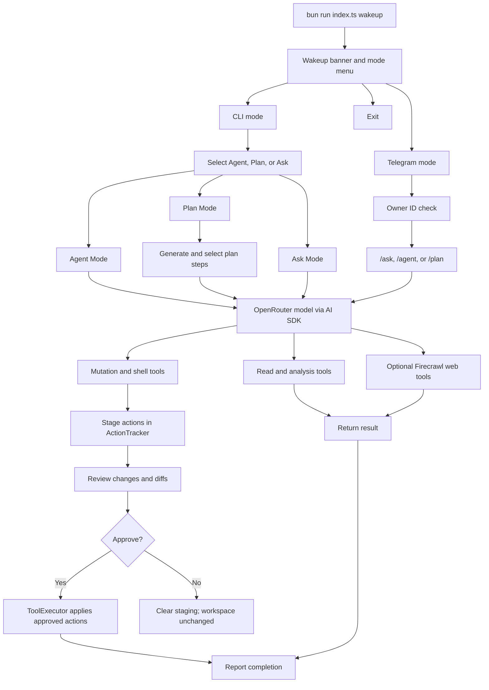

# Clawbot

```text
 ██████╗██╗      █████╗ ██╗    ██╗██████╗  ██████╗ ████████╗
██╔════╝██║     ██╔══██╗██║    ██║██╔══██╗██╔═══██╗╚══██╔══╝
██║     ██║     ███████║██║ █╗ ██║██████╔╝██║   ██║   ██║
██║     ██║     ██╔══██║██║███╗██║██╔══██╗██║   ██║   ██║
╚██████╗███████╗██║  ██║╚███╔███╔╝██████╔╝╚██████╔╝   ██║
 ╚═════╝╚══════╝╚═╝  ╚═╝ ╚══╝╚══╝ ╚═════╝  ╚═════╝    ╚═╝
```

Clawbot is an approval-first AI assistant for inspecting, planning changes to, and working with a local codebase. It runs as an interactive Bun CLI and can also expose the same workflows through a private Telegram bot.

Clawbot uses an OpenRouter-hosted model through the Vercel AI SDK. Read-only investigation happens during the model run, while file changes, deletions, directory creation, and shell commands are staged for review before they are applied.

## Features

- Interactive terminal UI with CLI and Telegram entry points.
- **Agent Mode** for carrying out a goal with workspace tools.
- **Plan Mode** for generating a multi-step plan, selecting steps, and executing the selection.
- **Ask Mode** for codebase questions and web research without file modification.
- Explicit approval screens for staged mutations, including diffs for modified files.
- Workspace-aware file reads, file search, codebase summaries, and optional skill-file discovery.
- Optional web search, crawling, and URL fetching through Firecrawl.
- Telegram owner verification using `TELEGRAM_OWNER_ID`.

## Requirements

- [Bun](https://bun.sh/) runtime.
- An OpenRouter API key.
- An OpenRouter model ID.
- Node-compatible shell support for commands queued by Agent Mode.
- Optional: a Telegram bot token for Telegram mode.
- Optional: a Firecrawl API key for web tools.

## Installation

Clone the repository and install dependencies:

```bash
git clone <repository-url>
cd clawbot
bun install
```

Clawbot does not currently load a `.env` file automatically. Set the required environment variables in the shell before starting it.

### PowerShell

```powershell
$env:OPENROUTER_API_KEY = "your-openrouter-api-key"
$env:OPENROUTER_DEFAULT_MODEL = "your/openrouter-model-id"
```

### Bash

```bash
export OPENROUTER_API_KEY="your-openrouter-api-key"
export OPENROUTER_DEFAULT_MODEL="your/openrouter-model-id"
```

`OPENROUTER_DEFAULT_MODEL` is passed directly to OpenRouter, so use a model identifier supported by your account. The application does not provide a fallback model.

## Running Clawbot

Run the interactive entry point from the project directory:

```bash
bun run index.ts wakeup
```

The package also declares the `clawbot-build` binary. When the package is available through Bun's executable resolution, the equivalent command is:

```bash
bunx clawbot-build wakeup
```

The startup menu asks whether to enter **CLI**, **Telegram**, or exit. The process uses the current working directory as the workspace root, so start it from the repository you want Clawbot to inspect or modify.

## Modes

### CLI mode

CLI mode presents three workflows:

#### Agent Mode

Enter a goal such as:

```text
Add validation to the user registration endpoint and update its tests.
```

The agent can read and analyze the workspace, create or replace files, delete files, create directories, and queue shell commands. Mutating operations are recorded by the action tracker and shown in the approval flow. Nothing is written or executed until the pending actions are approved.

Approved operations are applied together. Rejecting the approval flow clears the staged operations without changing the workspace.

#### Plan Mode

Enter a larger goal. Clawbot asks the model to produce a structured plan, displays the steps, and lets you choose which steps to execute. Each selected step is run as an agent task. Its staged changes are presented for approval after execution.

Plan Mode can also use the optional web tools when Firecrawl is configured.

#### Ask Mode

Ask questions about the current codebase, for example:

```text
Explain how authentication is wired through this project.
```

Ask Mode can read files, list and search files, summarize the codebase, inspect configured skills, and use the web tools. It does not permit file modification, folder creation, or shell execution during the answer. After the answer is displayed, you can optionally save it as a Markdown file in the current directory. The filename must be a simple `.md` filename, without path separators or `..`.

### Telegram mode

Set the Telegram variables before launching Clawbot:

```powershell
$env:TELEGRAM_BOT_TOKEN = "your-telegram-bot-token"
$env:TELEGRAM_OWNER_ID = "your-telegram-chat-id"
bun run index.ts wakeup
```

Choose **Telegram** from the startup menu. The bot sends a welcome message and continues running until interrupted with `Ctrl+C`.

Available commands for the configured owner:

| Command | Description |
| --- | --- |
| `/start` | Show the welcome message. |
| `/ask <question>` | Ask about the codebase or request web research. |
| `/agent <task>` | Run an agent task with approval before mutations are applied. |
| `/plan <goal>` | Generate a plan, select steps with inline buttons, and execute the selection. |

Telegram users whose chat ID does not match `TELEGRAM_OWNER_ID` are ignored. Approval messages provide inline buttons to inspect a diff, accept all pending changes, or reject them.

## Environment variables

| Variable | Required for | Description |
| --- | --- | --- |
| `OPENROUTER_API_KEY` | All AI modes | API key used to create the OpenRouter provider. |
| `OPENROUTER_DEFAULT_MODEL` | All AI modes | Model identifier passed to OpenRouter. |
| `TELEGRAM_BOT_TOKEN` | Telegram mode | Token issued by BotFather. |
| `TELEGRAM_OWNER_ID` | Telegram mode | Numeric Telegram chat/user ID allowed to use the bot. |
| `FIRECRAWL_API_KEY` | Web tools | Enables web search and crawling in Plan, Ask, and Telegram workflows where supported. |
| `SKILLS_DIRS` | Skill discovery | Semicolon-separated directories containing skill files. |

On Windows, `SKILLS_DIRS` uses semicolons between directories:

```powershell
$env:SKILLS_DIRS = "C:\path\to\skills;C:\path\to\other-skills"
```

## Workspace safety

Clawbot's default executor configuration:

- Uses `process.cwd()` as the codebase path.
- Limits individual file reads to 1 MiB.
- Excludes `node_modules`, `.git`, `dist`, `build`, `.next`, log files, and `.env*` patterns from workspace discovery.
- Validates workspace paths before file operations.
- Stages file mutations and shell commands until explicit approval in Agent and Plan workflows.
- Allows Ask Mode to create only the Markdown file the user explicitly chooses to save, and still sends that creation through approval.

Approval is a human checkpoint, not a sandbox. Review commands and file diffs carefully before accepting them, especially shell commands that may have side effects or access external services.

## Architecture

### Runtime flow



```text
index.ts
	└─ wakeup menu
			├─ CLI mode
			│   ├─ Agent orchestrator
			│   ├─ Plan orchestrator and planner
			│   └─ Ask orchestrator
			└─ Telegram mode
					└─ Telegram handlers and approval sessions

AI model: OpenRouter -> AI SDK ToolLoopAgent
Workspace actions: tools -> ToolExecutor -> ActionTracker -> approval -> apply
```

Important modules:

| Path | Responsibility |
| --- | --- |
| `index.ts` | Commander entry point and `wakeup` command. |
| `tui/wakeup.ts` | Banner and top-level CLI/Telegram selection. |
| `modes/cli.ts` | Interactive selection of Agent, Plan, and Ask modes. |
| `modes/agent/orchestrator.ts` | Runs a goal-oriented local agent. |
| `modes/agent/agent-tools.ts` | Defines file, analysis, skill, and shell tools. |
| `modes/agent/tool-executor.ts` | Validates, stages, and applies workspace operations. |
| `modes/agent/action-tracker.ts` | Records action status and before/after details. |
| `modes/agent/approval.ts` | Reviews staged operations and collects approval. |
| `modes/plan/` | Generates plans, selects steps, and provides web tools. |
| `modes/ask/orchestrator.ts` | Runs read-focused questions and optional Markdown export. |
| `modes/telegram/` | Bot startup, authentication, handlers, sessions, and Telegram execution. |
| `ai/ai.config.ts` | Creates the OpenRouter model from environment variables. |
| `tui/terminal-md.ts` | Renders model Markdown for the terminal. |


## Troubleshooting

### The model cannot start

Confirm that both `OPENROUTER_API_KEY` and `OPENROUTER_DEFAULT_MODEL` are set in the same shell that launches Bun. Also verify that the model identifier is valid for OpenRouter.

### Files are not found

Clawbot resolves relative paths from `process.cwd()`. Launch it from the intended workspace root rather than from the directory containing a globally installed executable.

### Web tools fail

Set `FIRECRAWL_API_KEY` before starting the process. Without it, web search and crawling are unavailable to the workflows that expose them.

### Telegram mode does not respond

Check the bot token and ensure `TELEGRAM_OWNER_ID` is the numeric chat ID for the account using the bot. The bot intentionally ignores all other chat IDs.

### Changes disappeared after rejection

That is expected. Mutations remain in memory until approval; rejecting or canceling the approval flow clears the staging area and leaves the workspace unchanged.

